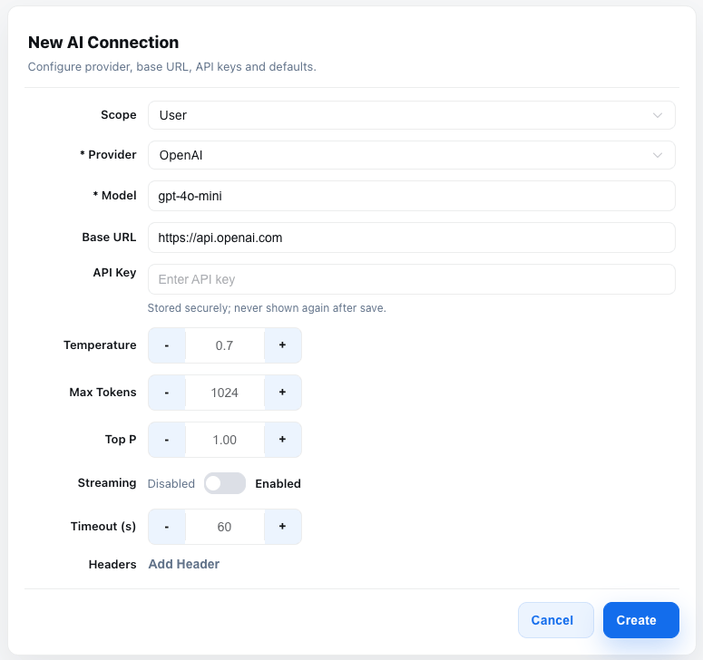
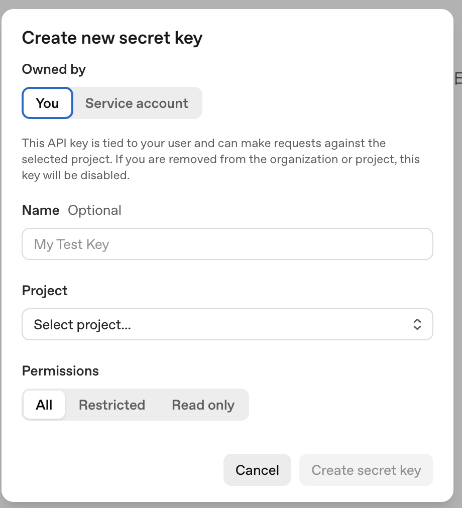
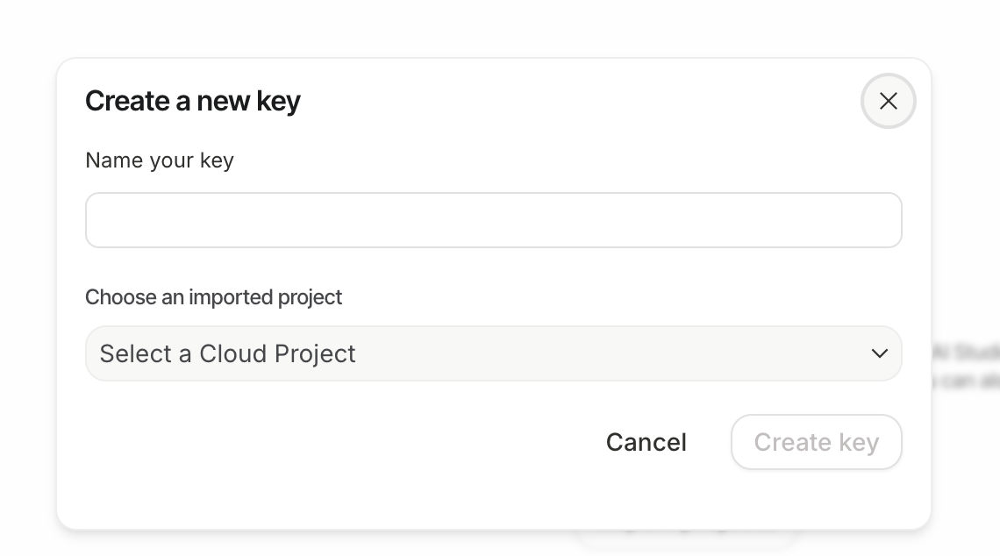
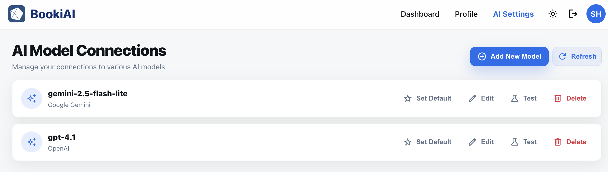
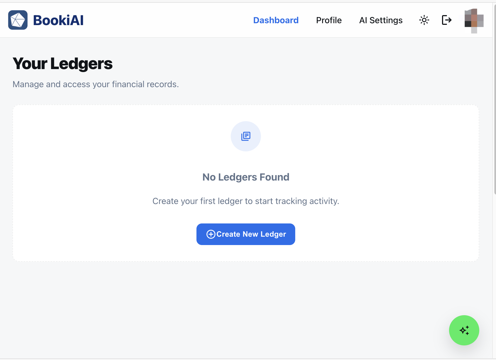

# Accounts & Access: From Sign-up to Billing

> For first-time BookiAI users: how to create an account, log in, verify email, manage passwords, understand free quotas, when to upgrade/expand, and how to downgrade/cancel.

## 1. Sign-up and Login
- **Sign-up URL**: `https://bookiai.com.au/register` (or your regional domain).
- **Required fields**:
  - Email (must be valid)
  - Password (min 8 characters, must include upper/lowercase letters and a number)
  - Confirm Password (must match)
  - Full Name (optional; saved if provided)
- **Email verification**: Optional after sign-up. You can verify later in the user/profile center; the verification email can be resent from there.
- **Login URL**: `https://bookiai.com.au/login`.
- **Login methods**: Email + password. SSO currently supported: Google (follow the login page prompt).
- **Common errors**:
  - “Invalid credentials” → check email spelling and case; reset password if needed.
  - No verification email → check spam or whitelist `bookiai.com.au`; click “Resend verification email” on the login page.

> Screenshots:  

## 2. Top Navigation (after login)
- **Dashboard**: Default landing for ledgers, tasks, recent entries.
- **Profile**: Update name, avatar, security details, password; view email verification status.
- **AI Settings**: Configure AI connectors/preferences. First login may prompt setup; after that, access it via the top nav (no auto-redirect).
- **Header actions**: Theme toggle, user avatar, logout.
- **Screenshot**:  (highlight Dashboard, Profile, AI Settings, avatar/logout)

## 3. First Login → AI Settings (why)
- **Why the redirect**: The product relies on AI assistants via external APIs. On first login you’ll be taken to **AI Settings** to provide API keys so features can run.
- **What to do**: Enter at least one valid provider key, save, and test connection. After this initial setup, future logins go to Dashboard; AI Settings remains in the top nav.
- **Supported providers & how to get keys**:
  - **Gemini (Google AI)**: Create a key in Google AI Studio → “Get API key”. Paste the key into Gemini section. For multimodal (text+image), use `gemini-1.5-pro` or `gemini-1.5-flash`.
  - **OpenAI**: Create key in OpenAI console (User API keys). Paste into OpenAI section. For multimodal, use `gpt-4o` or `gpt-4o-mini` (supports image input).
- **Model recommendations (multimodal)**:
  - Gemini: `gemini-1.5-pro` (higher quality), `gemini-1.5-flash` (faster/cheaper).
  - OpenAI: `gpt-4o` (full quality), `gpt-4o-mini` (fast/cheap).
- **Security note**: Store keys securely; rotate if leaked. Keys are used only server-side to call LLM APIs.
- **Screenshot**:  (Gemini/OpenAI key inputs and save/test actions)
- **Parameter guide** (defaults shown in UI):
  - Provider: OpenAI or Gemini (choose one; more can be added later).
  - Model: e.g., `gpt-4o-mini` (OpenAI) or `gemini-1.5-flash` (Gemini); use `gpt-4o`/`gemini-1.5-pro` for higher quality or multimodal.
  - Base URL: OpenAI `https://api.openai.com`; Gemini `https://generativelanguage.googleapis.com` (override only if using a proxy).
  - API Key: required on create; stored securely and not re-displayed.
  - Temperature (default ~0.7): higher = more creative, lower = more deterministic.
  - Max Tokens (default ~1024): response length cap; raise for longer outputs.
  - Top P (default 1): nucleus sampling; leave default unless you know you need to tune it.
  - Streaming (default off): turn on for incremental responses if your use case needs it.
  - Timeout (default ~60s): increase only if long-running prompts time out.
  - Headers: optional custom HTTP headers (e.g., org IDs); usually leave empty.
  - Default model: set from the AI Settings list via “Set Default”; used by assistants if no model is specified.

### 3.1 OpenAI API: how to get a key
- Go to [platform.openai.com/settings/organization/api-keys](https://platform.openai.com/settings/organization/api-keys) (requires OpenAI account and sign-in) → “Create new secret key”. Usage may incur charges.
- Copy the key once; paste into AI Settings → OpenAI → API Key. Keep it private.
- Recommended models: `gpt-4o` (quality, multimodal) or `gpt-4o-mini` (fast/cheap, multimodal).
- Screenshots:  

### 3.2 Gemini API: how to get a key
- Go to [aistudio.google.com](https://aistudio.google.com/) → “Get API key” → select project → generate key.
- Copy the key; paste into AI Settings → Gemini → API Key.
- Recommended models: `gemini-1.5-pro` (quality, multimodal) or `gemini-1.5-flash` (fast/cheap, multimodal).
- Screenshots:  

### 3.4 AI Model Connections page (manage later)
- **Where**: Top nav → AI Settings (any time after initial setup).
- **You can**: Add new connection (provider/model/base URL/key), edit, set default, test latency/tokens, delete unused.
- **Default model**: Mark via “Set Default” in the list; used by assistants if none specified.
- **Screenshot**:  (cards with provider/model, Default badge, Set Default/Edit/Test/Delete).

## 4. Dashboard (after AI Settings)
- **Landing**: After saving AI Settings, you’ll land on Dashboard to manage ledgers.
- **Free user limits**: 1 free ledger, storage per ledger: 100 MB.
- **Paid member limits**: 5 ledgers, each 1 GB, plus 1 membership system ledger for billing records.
- **What you can do**: Open ledgers, view tasks/activity, jump to ledger setup, check usage vs quota.
- **Screenshot**:  (show ledger list, usage/quotas).

## 5. Profile (free vs member) & why billing exists
- **Profile for all users**: Update name, avatar, password/security; view email verification status.
- **Free vs member mode**:
  - Free: 1 ledger @ 100 MB, basic features.
  - Member: 5 ledgers @ 1 GB each + membership ledger; advanced features and higher quotas.
- **Upgrade/expand**:
  - Go to Billing/Subscription from Profile to upgrade membership.
  - Buy extra ledger slots if you need more than the included count.
  - Buy extra storage per ledger if you are near the cap.
- **Member controls** (Profile page buttons):
  - **Add Ledger Slots**: purchase additional ledger capacity beyond the included quota.
  - **Add Storage**: purchase extra storage for ledgers when approaching the cap.
  - **Manage in Stripe portal**: open the Stripe customer portal to update payment methods, view/download invoices, adjust plans, or manage cancellations.
- **Why fees**: Membership/ledger fees cover cloud costs (Google storage for ledger files, network bandwidth, and related services) and basic operations. The platform was built entirely with AI tools (OpenAI Codex, Stitch, Gemini, etc.), and we do not charge to recoup development; your payment primarily covers your own cloud usage.
- **Screenshots**: 
  -  (profile info, upgrade links, quota overview for free users)
  -  (profile info, billing/ledger/storage summary for members)

## 6. AI Assistant (in app)
- **What it does**: Helps draft journal entries, classify transactions, and answer ledger questions using your configured AI model.
- **Entry points**: Available within ledgers (tasks/entries) and via the AI panel; uses your default model from AI Settings.
- **Permissions**: Respects your account/ledger access; outputs stay within your tenant.
- **Screenshot**:  (assistant panel with prompt/response).

## 7. Email Verification & Security
- **Immediate use**: After registering you become a free user and can log in/use the app right away.
- **How to verify (optional)**: In the user/profile center, resend the verification email and complete it from there; useful for enabling email-based notifications and strengthening account trust.
- **Security tips**: Even without mandatory verification, keep a strong password and enable MFA if available; never share your account.

> Screenshot:  (unverified banner / verification email).

## 8. Password Management
- **Change password**: In “Profile / Security”, provide current password and set a new one.
- **Forgot password**: On the login page click “Forgot password” and reset via email; check spam if you don’t see it.
- **Best practices**: Use a password manager; rotate periodically; avoid reuse; enable MFA if supported.

## 9. Accounts & Quotas (Free vs Paid)
- **Free tier** (example; update with latest pricing):
  - Ledgers: 1
  - Storage: 100 MB
  - Members: 1–2 (self/small team trial)
  - Features: core journals, limited AI suggestions, some automations disabled
  - Storage use: documents and images such as vouchers, invoices, receipts.
- **Paid tiers add**:
  - More ledgers and storage (plus add-on expansion)
  - Advanced AI/automation
  - Team collaboration (multi-user, approvals, comments)
  - Priority support and audit logs
- **When to upgrade**:
  - Need 2+ ledgers (multi-entity / multi-currency)
  - Storage near the cap; attachments blocked or slowed
  - Team collaboration, approvals, and audits required
  - Want advanced AI/automation and external reporting

> Table/visual:  (free vs paid quotas).

## 10. Upgrades & Expansions
- **Where**: `Billing / Subscription` inside the app; pick a paid plan or customize add-ons.
- **Add-ons**:
  - Extra ledgers (per-ledger pricing)
  - Extra storage (per GB)
- **Billing & invoices**: Credit card/invoicing supported; invoices downloadable from Billing history.
- **Effective time**: Upgrades/expansions typically apply immediately; proration follows the billing page rules.

## 11. Downgrade / Cancel
- **Where**: `Billing / Subscription` → Manage → Downgrade/Cancel.
- **Effective time**: Usually end-of-current-cycle; paid benefits remain until then.
- **Data/limits after downgrade**:
  - You must choose one ledger to keep active after downgrade; other ledgers become read-only (no new entries).
  - Storage limit reverts to 100 MB for the remaining ledger; existing files remain accessible but no new uploads once over the cap.
  - If ledgers/storage exceed new limits, use the grace period to archive/export and reduce usage.
  - Export key data/attachments before downgrading.
- **Come back anytime**: You can re-upgrade later; data stays unless explicitly purged.

## 12. Quick self-check
- [ ] Email verified; can log in without prompts.
- [ ] Password updated; MFA enabled if available.
- [ ] Aware of current ledger/storage usage vs quota.
- [ ] Know where to upgrade/expand and how billing works.
- [ ] Understand downgrade timing and data/limit implications.

---

> Next: [Creating Your First Ledger](./creating-your-first-ledger.md) — create a ledger, import chart of accounts, set opening balances.
