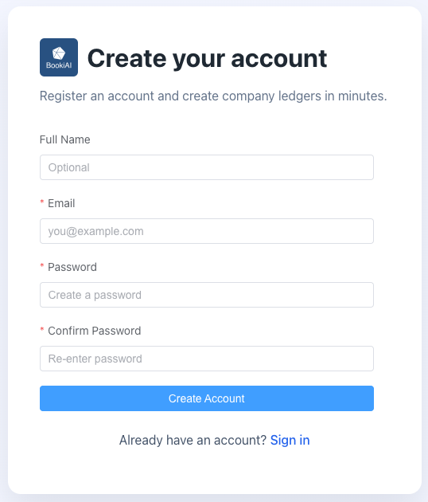
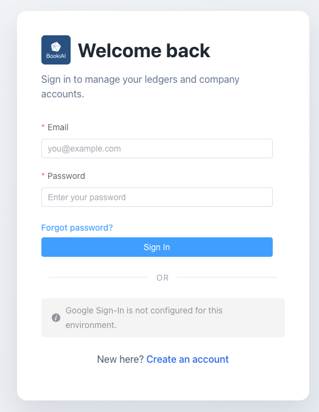
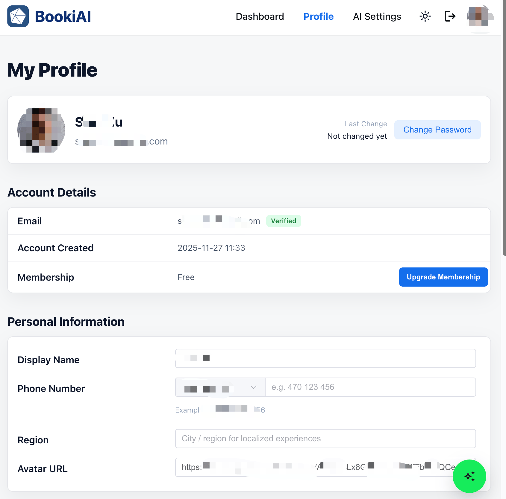
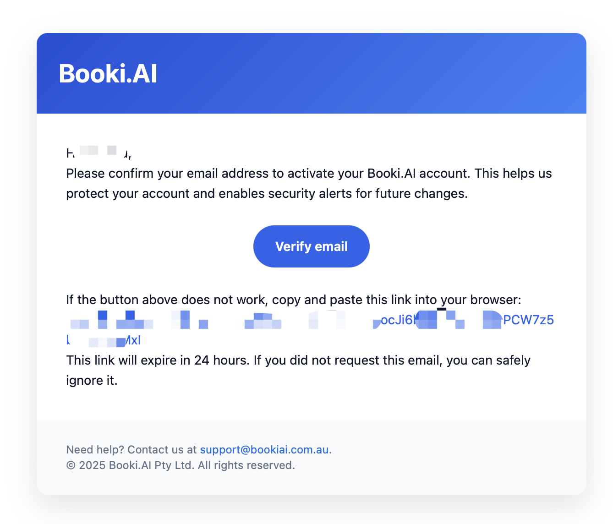
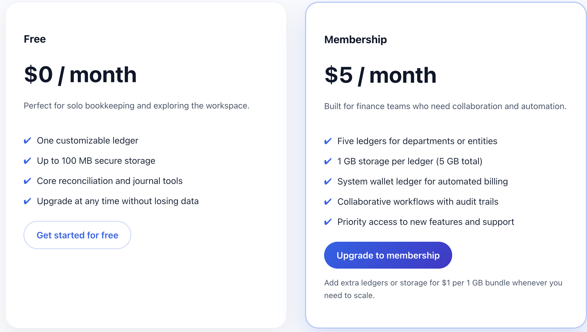

# 账户与访问：从注册到计费

> 面向首次使用 BookiAI 的用户：如何创建账号、登录、验证邮箱、管理密码、了解免费额度、何时升级/扩容，以及如何降级/取消。

## 1. 注册与登录
- **注册地址**：`https://bookiai.com.au/register`（或你所在区域的域名）。

  

- **必填字段**：
  - 邮箱（必须有效）
  - 密码（至少 8 位，需包含大小写字母和数字）
  - 确认密码（需与密码一致）
  - 全名（可选；如填写会保存）
- **邮箱验证**：注册后可选，稍后可在用户/个人中心完成验证；可在该处再次发送验证邮件。
- **登录地址**：`https://bookiai.com.au/login`。

  

- **登录方式**：邮箱 + 密码。当前支持的 SSO：Google（按登录页提示操作）。
- **常见错误**：
  - “Invalid credentials” → 检查邮箱拼写和大小写；必要时重置密码。
  - 未收到验证邮件 → 检查垃圾邮箱或将 `bookiai.com.au` 加入白名单；在登录页点击 “Resend verification email”。

## 5. 个人中心（免费 vs 会员）及计费原因
- **所有用户的个人中心**：更新姓名、头像、密码/安全信息；查看邮箱验证状态。
- **免费 vs 会员模式**：
  - 免费：1 个账簿 @ 100 MB，基础功能。
  - 会员：5 个账簿 @ 各 1 GB + 会员账簿；高级功能和更高额度。
  

    
  

- **升级/扩容**：
  - 从个人中心进入 Billing/Subscription 升级会员。
  - 需要超出包含数量的账簿时购买额外配额。
  - 存储接近上限时为单个账簿购买额外存储。
- **会员控制**（个人中心按钮）：
  - **Add Ledger Slots**：购买超出包含配额的账簿数量。
  - **Add Storage**：在接近上限时为账簿购买额外存储。
  - **Manage in Stripe portal**：打开 Stripe 客户门户更新支付方式、查看/下载发票、调整套餐或管理取消。
- **为何收费**：会员/账簿费用覆盖云资源（账簿文件的 Google 存储、网络带宽等）和基本运维。平台完全由 AI 工具（OpenAI Codex、Stitch、Gemini 等）构建，我们不为开发成本收费；你支付的主要是自身的云使用。
- **截图**：
  

    
  

## 6. 应用内 AI 助手
- **作用**：按照你配置的 AI 模型，帮助草拟分录、分类交易并回答账簿问题。
- **入口**：在账簿（任务/分录）内及 AI 面板均可使用；默认使用 AI 设置中的模型。
- **权限**：遵循你的账户/账簿访问控制；输出仅在你的租户内可见。
- **截图**：
  

    
  

## 7. 邮箱验证与安全
- **立即可用**：注册后即成为免费用户，可直接登录使用。
- **如何验证（可选）**：在用户/个人中心重新发送验证邮件并完成验证；有助于开启邮件通知并提升账户信任度。
- **安全提示**：即便非强制验证，也请保持强密码并在可用时启用 MFA；不要共享账号。

> 截图：
> 

>   
> 

## 8. 密码管理
- **修改密码**：在 “Profile / Security” 中输入当前密码并设置新密码。
- **忘记密码**：在登录页点击 “Forgot password”，通过邮件重置；未收到请查垃圾邮件。
- **最佳实践**：使用密码管理器；定期更换；避免重复使用；如支持请开启 MFA。

## 9. 账户与额度（免费 vs 付费）
- **免费层**（示例，实际以最新定价为准）：
  - 账簿：1
  - 存储：100 MB
  - 成员：1–2（自测/小团队试用）
  - 功能：核心分录，有限 AI 建议，部分自动化关闭
  - 存储用途：凭证、发票、收据等文档和图片。
- **付费层增加**：
  - 更多账簿与存储（可按需扩展）
  - 更强的 AI/自动化
  - 团队协作（多用户、审批、评论）
  - 优先支持与审计日志
- **何时升级**：
  - 需要 2+ 个账簿（多实体/多币种）
  - 存储接近上限；附件受限或变慢
  - 需要团队协作、审批和审计
  - 需要高级 AI/自动化与外部报表

> 表格/示意：
> 

>   
> 

## 10. 升级与扩容
- **入口**：应用内 `Billing / Subscription`；选择付费套餐或自定义附加项。
- **附加项**：
  - 额外账簿（按账簿计费）
  - 额外存储（按 GB 计费）
- **计费与发票**：支持信用卡/开票；可在 Billing 历史下载发票。
- **生效时间**：升级/扩容通常立即生效；按计费页规则进行按比例计费。

## 11. 降级/取消
- **入口**：`Billing / Subscription` → Manage → Downgrade/Cancel。
- **生效时间**：通常在当前计费周期末；付费权益在此之前仍有效。
- **降级后的数据/限制**：
  - 你需要选择一个账簿保持活跃；其他账簿变为只读（无法新增分录）。
  - 存储上限恢复为该账簿 100 MB；超过上限的文件仍可访问，但不能新增上传。
  - 如账簿/存储超过新限制，利用宽限期归档/导出并降低用量。
  - 降级前导出关键数据/附件。
- **随时回归**：可以之后再次升级；除非明确清理，数据会保留。

## 12. 自查清单
- [ ] 邮箱已验证；可无阻碍登录。
- [ ] 密码已更新；如支持已启用 MFA。
- [ ] 清楚当前账簿/存储使用与额度。
- [ ] 知道在哪里升级/扩容以及计费规则。
- [ ] 了解降级生效时间和数据/额度的影响。

---

> 下一篇：[创建你的第一个账簿](./03-creating-your-first-ledger.md) — 创建账簿、导入科目表、设置期初余额。
