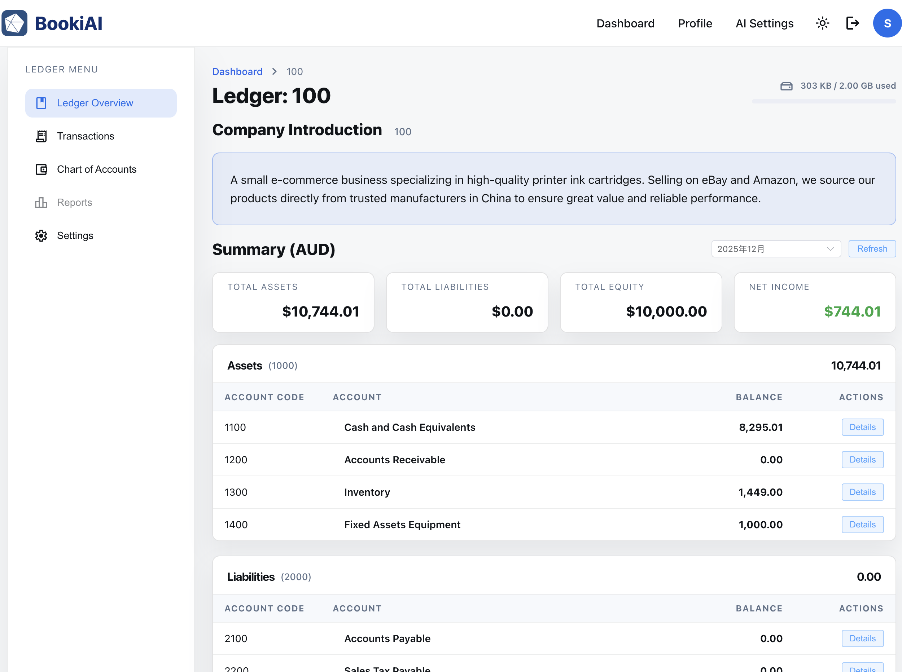

# 账簿总览

> 说明账簿总览页能看到什么、每个区域的目的，以及截图应放在哪里。

## 1. 页面用途
- 为所有用户提供一个入口，快速查看账簿状态：余额、存储占用、告警与快捷操作。
- 将业务账簿与系统钱包账簿分开，便于透明查看计费与用量。
- 为想要自动建议的用户提供 AI 快捷入口，无需进入设置菜单。

  

## 2. 侧边栏导航
- 导航菜单包含：
  - Ledger Overview（本页面）
  - Transactions（Journal Entries List）
  - Chart of Accounts
  - Reports（暂未实现）
  - Settings（账簿设置）

## 3. 页面头部与公司简介
- 顶部栏左侧显示账簿名称，右侧显示存储容量标签（例：“620 MB of 1 GB used”）。
- 当接近上限时，存储提示可跳转到扩容入口。
- 头部下方是公司简介卡片，概括创建账簿时填写的业务描述。

## 4. 账簿汇总卡片
- 按资产负债表（资产/负债/权益）和损益表（收入/费用）分组，便于区分财务状况与经营表现。
- 每张卡片展示账簿名称和当前总额。
- 快捷操作：打开账簿、查看 AI 概览、跳转最近分录。

## 5. 科目余额表格
- 卡片下方的分组表格列出科目代码（如 Cash 1010、Revenue 5000）及其当前余额，按类别归属。
- 点击 “详情” 按钮进入对应科目的交易明细。
- 用于快速对比关键余额，如应收账款 vs 销售收入。

## 6. 下一步
- 前往“账簿分录”录入或查看分录。
- 需要新的科目表或自动分录草稿时，使用 AI 面板。

---

> 下一篇：[账簿分录](./05-ledger-journal-entries.md)
