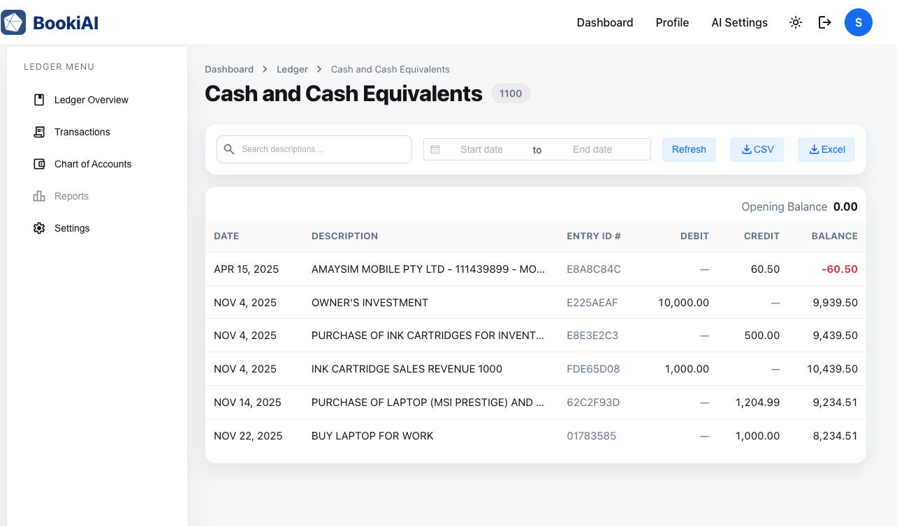

# 科目明细

> 针对单个科目追踪所有分录，快速筛选，并在同一页查看附件。

  

## 1. 页面用途
- 聚焦查看某一科目的全部分录及余额与附件。
- 帮助核对、发现异常，并为结账或审计做准备。

## 2. 顶部信息
- 从科目表或仪表盘卡片进入；顶部显示代码、名称、科目类型和当前余额。
- 提供复制科目代码或返回科目表的快捷操作。

## 3. 列表与筛选
- 交易按日期分组，显示参考号、描述、借/贷、附件标识及对账状态。
- 筛选条件：日期范围、来源单据、状态（已过账/草稿）、标签；可按参考号或对手方搜索。

## 4. 交易详情
- 点击行会跳转至该交易的分录详情页，查看完整行拆分与附件。
- 可在详情页添加审计备注或下载支撑文件。

## 5. 下一步
- 想创建新分录？返回 [账簿分录](./05-ledger-journal-entries.md)。

---
