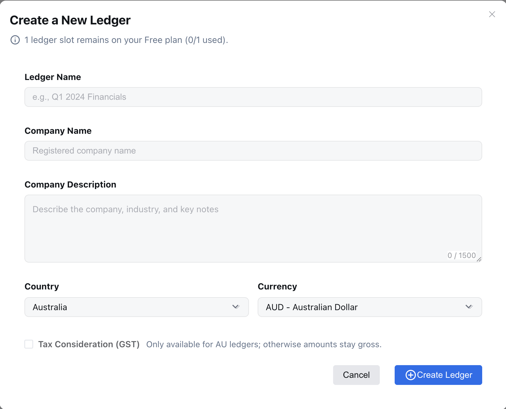
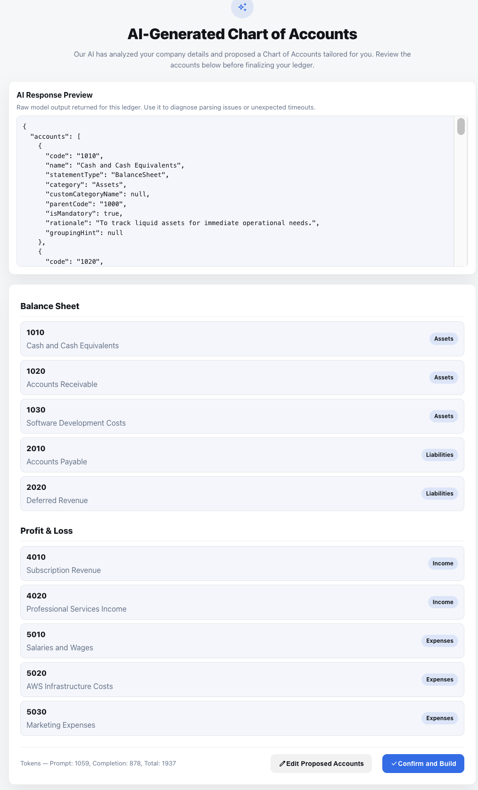

# Creating Your First Ledger

> Walkthrough for new users to create their first ledger, import accounts, and get ready for transactions.

## 1. Create a ledger
- **Where**: Dashboard → “Create ledger” (or “Add ledger” for members).
- **Fields & defaults** (from the create form):
  - **Ledger Name** (required, ≥3 chars): e.g., “Q1 2024 Financials”.
  - **Company Name** (required, ≥3 chars): legal/registered name.
  - **Company Description** (optional, ≤1500 chars): describe business, industry, key products/services. **This is sent to the AI to propose a tailored Chart of Accounts right after creation. Provide specifics (sector, revenue model, regions, GAAP/IFRS hints) for better suggestions.**
  - **Country**: currently `AU`.
  - **Currency**: default `AUD`; options include USD/EUR/GBP/CNY/JPY/NZD/SGD/CAD/HKD.
  - **Tax Consideration (GST)**: available when Country = AU; check if you need GST breakdowns.
- **Free vs member**: Free has 1 ledger; members can create up to their slot limit.
- **Screenshot**:
  

    
  

## 2. AI suggestions after ledger creation
- After you finish the ledger setup, the system automatically posts the company description (and other profile/context information) to the AI assistant.
- The AI returns a proposed chart of accounts that you can review in the “AI Suggestions” panel; it honors the company description, complies with local rules, and uses the gap-friendly numbering you requested.
- Accept the proposal to populate the ledger; you can always edit or delete accounts afterward.
- Screenshot: 
  

    
  

## 3. Next steps
- Post your first journal entry or upload source documents for AI-assisted entries.
- (Optional) Configure automations and alerts.

## Example company description
> “BookiAI delivers AI-assisted bookkeeping for Australian tech scaleups. We manage multi-entity finance operations for a SaaS business with recurring revenue, multiple payment channels, and a mix of USD/AUD customers. Key activities include software subscriptions, professional services, and AWS infrastructure costs. Compliance follows AASB/IFRS, and we track expenses by product line and region.”
>
> Use this example as a template for the company description field so the AI can tailor Chart of Accounts suggestions—mention any vertical, revenue model, currency mix, or compliance rules that matter to you.

---
> Next: [Ledger Overview](./04-ledger-overview.md).
