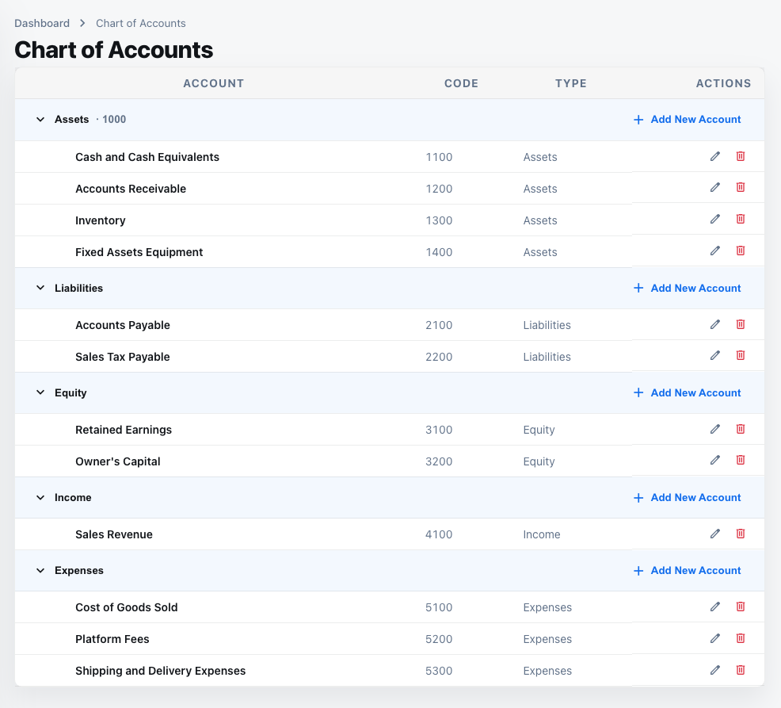
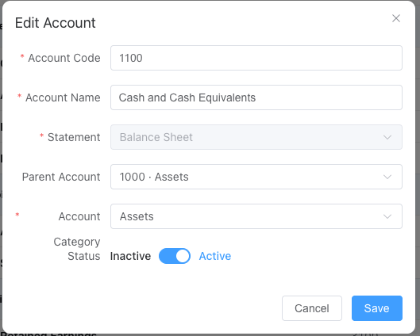

# Chart of Accounts

> Review, adjust, and expand your accounts in one place. Use the AI toolbar when you need new codes fast.

  

## 1. What this page is for
- Central place to see every account, its code, statement type, category, and current balance.
- Quick search and filters help you find the right account before posting entries.

## 2. List view and filters
- Search by code or name; filter by Balance Sheet or P&L categories (assets, liabilities, income, expenses).
- Columns show code, name, statement type, category, and balance.

## 3. Edit an account
- Use the edit action to change name, statement type, category, or parent.
- Adjust the code if needed (keeping gap numbering), and mark tags like “mandatory” or “internal only.”
- Changes reflect immediately in journal entry suggestions.

  

## 4. Add or remove accounts
- “Add Account” opens a form for code, name, statement type, and parent.
- Removal is allowed only when the account has no blocking entries; reconcile or move balances first.
- New accounts follow the gap rules; AI may suggest the next available code.

## 5. AI recommendations
- Open the AI Suggestions toolbar, describe the business need, and get a proposed code/name/rationale.
- Approve to auto-create the account, then continue processing entries with the new code.

  

## 6. Next steps
- After configuring accounts, go to [Accounts Transactions](./08-accounts-transactions.md) to review each account’s entries.

---
